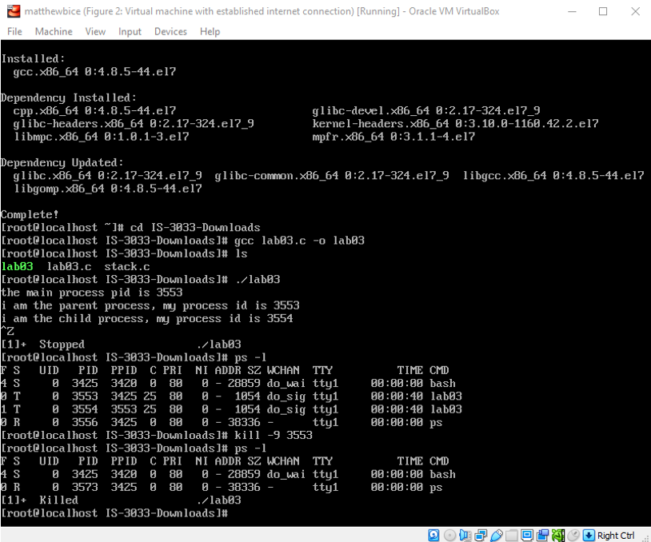
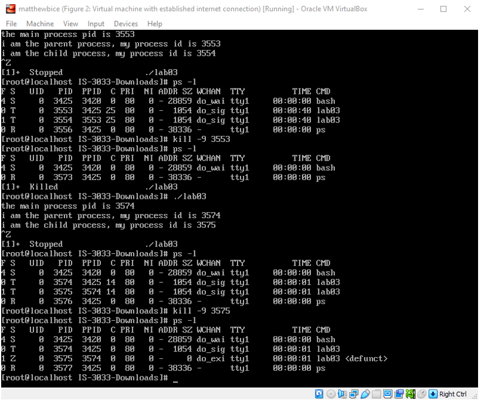
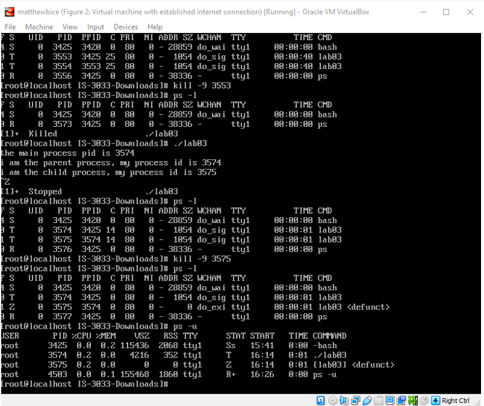

# Introduction

When it comes to operating a computer, it is essential for the user (or, in modern terms, the machine) to keep track of any ongoing processes. In the first part of the lab, I will be demonstrating the use of the process, or “ps”, command to show processes and their status in addition to the relationship between a parent and child process. Then, in the second part, I will be working through some examples of process scheduling to show the results of different schedulers and how some schedulers are better than others in some instances.

# Process Management Practice

## Installing the Program and Compiling It for Use on CentOS

The first thing I do in this lab is install the program “git” so that I can bring the necessary files into my virtual machine. To do so, I will once again be using “yum” with the command “yum install git”. After a brief prompt, the necessary files load up and git is installed on my machine. With git installed, the next step is to download the necessary code for the lab. To do so, I will be “cloning” the destination file onto my machine. As such, the command will be “git clone” in addition to the URL for the code folder. After typing the command out, the folder is successfully loaded into my “root” directory. Within the folder is the file “lab03.c” which is the file I need. Also located in the folder is an extraneous “stack” file. However, the lab file is only source code for the program. In order to run it on Linux, I must first compile the code into a useable program. This will be done with Linux’s local C compiler, GCC. Using yum again, I install the compiler. Next, with the command “gcc lab03.c -o lab03”, I compile the program. The “-o” option sets a name for the compiled program. In this case, the name will be “lab03” (Geeks for Geeks). With this in place, I use “cd” to change the current directory to the “IS-3033-Downloads” folder. After listing the files within it, I notice that my desired program is printed in green text. This means that the file is an executable program. Therefore, the compilation was a success.

## Running the Program and Discussing the Relationships between a Parent and Child Process

With the program ready to run, I type in the command “./lab03”. The “./” can be thought of as a pointer to the current directory. This is necessary to run programs that are not located in Linux’s “bin” or “sbin” folders. From there, the program runs, and the output is displayed. Using “ctrl + z”, I push the command to the background. Next, I list the processes in the terminal with “ps -l” which will print all running processes in the terminal along with names and labels (Tech on the Net). In doing so, I can verify that the PID of the parent and child processes match those that are mentioned in the program. With the information verified, I am ready to test the relations of the parent and child processes.

### Investigation 1

After using the command “kill -9 3553”, the parent process of the program is killed. The “-9” option is the “SIGKILL” signal that the “kill” command sends to kill the program. As a result, the child process is also killed. As the following figure will show, in the first process list, there are four processes. In the second, there are two processes. This means that when the parent process was killed, so too was the child. This is the expected result of killing a parent process.

- _Figure 1_: Steps 1-4 of the lab in addition to the current investigation. Notice how after entering the “kill” command for parent process 3553, the parent and child process disappear from the list when it is called forth again.

  

### Investigation 2

For this investigation, running the program again indicates that the PIDs for the parent and child processes have changed. Nevertheless, entering “kill -9 3575” (3575 being the PID for the child process), keeps the parent process alive, but labels the child process as “defunct” despite still being listed with the other processes. This means that the child process has become a zombie process which implies that the parent process has failed to recycle the “body” of the child process.

- _Figure 2_: At the halfway point, this section of the lab is executed. The program is called again, and the command is passed to kill the child process. Notice how in the final process list, process 3575, the child process, is labeled as “defunct.” This means that the process has become a zombie.

  

### Investigation 3

Leaving the processes as they are, I enter the command ‘ps -u”. This command will list all the ongoing processes under a specific user (CyberITHub). I suspect that the lack of a specific username after the option implies the current user. Going down by the columns in the bottom table of Figure 3:

| Column Label        | Definition         |
|:-------------|:------------------|
| PID           | The process ID number. The parent process is 3575, and the child zombie process is 3575. |
| %CPU | The amount of CPU usage from each program. Notice how the zombie program is still taking up processing space.|
| %MEM           | The amount of memory being used. Neither process appears to be taking up memory.      |
| VSZ           | “Virtual Memory Size.” The size of memory that Linux has given to a process (LinuxConfig). This does not necessarily mean that all this memory will be used. The parent process has a fair amount of memory allocated to it whereas the child zombie process has no memory available. |
| RSS           | “Resident Set Size.” The size of memory that a process has used to load all its pages (LinuxConfig). Once again, the parent process is using a decent amount of memory whereas the child zombie process is not using any memory. |
| TTY           | Prints the name of the terminal I am using (How-To Geek). In this case, the processes are taking place on terminal 1. |
| STAT           | Shows the statuses of processes. In this case, the “T” of the parent process means that the process has been stopped (moved to the background), and the “Z” of the child process identifies it as a zombie (Die.net). |
| START           | The start time of the processes. The times for the parent and child processes are the same.  |
| TIME           | The amount of time the CPU has used for a process (Die.net). Both the parent and child zombie process take one second. |
| COMMAND           | The command that commences the process. The parent process is labeled with the right command, “./lab03”, but the child zombie process states that the command has to do with lab03 but is defunct. |

- _Figure 3_: The bottom table shows the output for “ps -u”. Notice how this process list is different from the previous ones. Notice how the child process, despite being defunct, is still taking up resources on the processor. Each column regarding the parent and child processes is covered in-depth above.

  

# Process Scheduling

This section is a hands-on demonstration of process scheduling. Given information about each process' burst times, I will create a Gantt chart for each process list, explain their completion order, and calculate the total turnaround times and average turnaround times.

## Problem 1

In this problem, FIFO (First in, Last out) scheduling is used, and all processes arrive at the same time. Therefore, they will be executed in a random order.

| Process        | Burst Time (in ms)         |
|:-------------|:------------------|
| P1           | 3 |
| P2           | 11   |
| P3           | 16      |
| P4           | 6 |
| P5           | 2 |

    P1&nbsp;&nbsp;&nbsp;&nbsp;&nbsp;&nbsp;&nbsp;&nbsp;&nbsp;P2&nbsp;&nbsp;&nbsp;&nbsp;&nbsp;&nbsp;&nbsp;&nbsp;&nbsp;&nbsp;&nbsp;&nbsp;&nbsp;&nbsp;&nbsp;&nbsp;P3&nbsp;&nbsp;&nbsp;&nbsp;&nbsp;&nbsp;&nbsp;&nbsp;&nbsp;&nbsp;&nbsp;&nbsp;&nbsp;P4&nbsp;&nbsp;&nbsp;&nbsp;&nbsp;&nbsp;P5

|----|-----------|----------------|------|-----|

    0&nbsp;&nbsp;&nbsp;&nbsp;3

